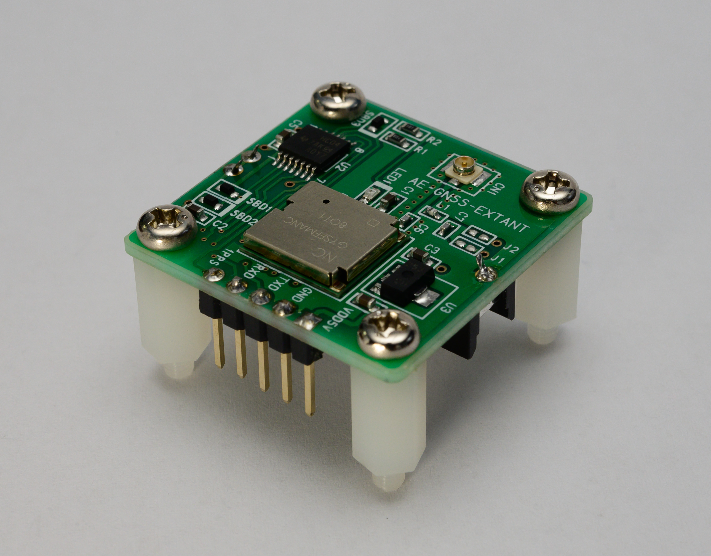

なんか無いとラリるけど出力はされない章
======================================

はじめに
===========

Author : 著者名

TODO: 前書きを書いてね
------------------------------

前書き

画像コレクション
~~~~~~~~~~~~~~~~

.. widefigure:: images/misodengaku/mounted.jpg

    でっかく画像貼るときの例

    そこまで強気じゃないとき

.. widefigure:: images/misodengaku/ntpq.eps

    ベクター画像な気分のとき

書いてね
~~~~~~~~~~~~~~~~

引用 [#quote-example]_ したいとき

.. [#quote-example] テストリンク(http://example.com/)

* 項目1
* 項目2
* 項目3
* 項目4

.. code-block:: c

    void special_function(char *dst)
    {
        strcpy(dst, "super!");
    }

1) 変更
2) して
3) ください

.. csv-table:: 表
   :header: 値, 意味
   :widths: 5, 5

    0,unspecified
    1,invalid
    2-255,reserved
